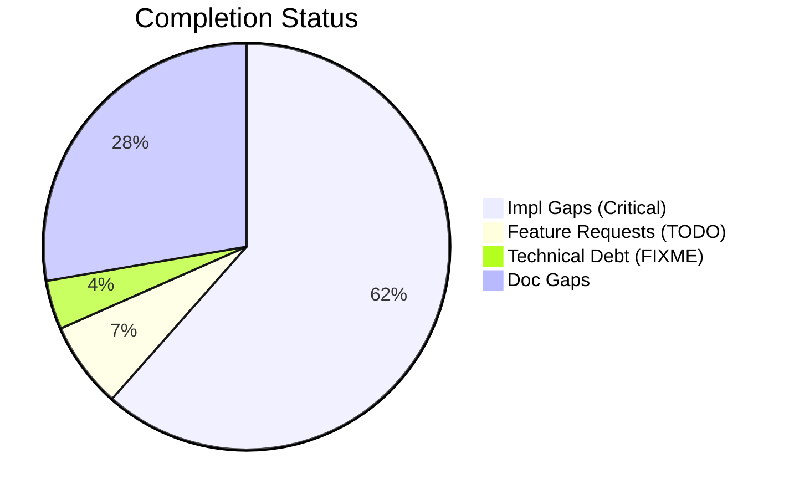
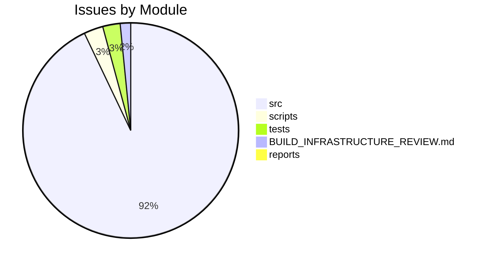

# Completist Report: 2026-03-09

## Executive Summary
- **Critical Gaps**: 331
- **Feature Gaps (TODO)**: 37
- **Technical Debt**: 21
- **Documentation Gaps**: 149

## Visualization
### Status Overview

### Top Impacted Modules

## Critical Incomplete (Top 50)
| File | Line | Type | Impact | Coverage | Complexity |
|---|---|---|---|---|---|
| `./src/engines/Simscape_Multibody_Models/3D_Golf_Model/matlab/src/apps/golf_gui/Simscape Multibody Data Plotters/Python Version/golf_gui_r0/golf_visualizer_implementation.py` | 558 | Stub | 5 | 2 | 4 |
| `./src/engines/Simscape_Multibody_Models/3D_Golf_Model/matlab/src/apps/golf_gui/Simscape Multibody Data Plotters/Python Version/golf_gui_r0/golf_visualizer_implementation.py` | 852 | Stub | 5 | 2 | 4 |
| `./src/engines/Simscape_Multibody_Models/3D_Golf_Model/matlab/src/apps/golf_gui/Simscape Multibody Data Plotters/Python Version/integrated_golf_gui_r0/golf_playback_controller.py` | 269 | Stub | 5 | 2 | 4 |
| `./src/engines/physics_engines/drake/python/src/drake_gui_app.py` | 358 | Stub | 5 | 2 | 4 |
| `./src/engines/physics_engines/mujoco/python/humanoid_launcher_analysis.py` | 297 | Stub | 5 | 2 | 4 |
| `./src/engines/physics_engines/mujoco/python/mujoco_humanoid_golf/pinocchio_interface.py` | 154 | Stub | 5 | 2 | 4 |
| `./src/engines/physics_engines/mujoco/python/mujoco_humanoid_golf/examples_chaotic_pendulum.py` | 71 | Stub | 5 | 2 | 4 |
| `./src/engines/physics_engines/mujoco/python/mujoco_humanoid_golf/examples_chaotic_pendulum.py` | 75 | Stub | 5 | 2 | 4 |
| `./src/engines/physics_engines/mujoco/python/mujoco_humanoid_golf/urdf_io.py` | 514 | Stub | 5 | 2 | 4 |
| `./src/engines/physics_engines/mujoco/python/mujoco_humanoid_golf/gui/core/main_window.py` | 465 | Stub | 5 | 2 | 4 |
| `./src/engines/physics_engines/mujoco/docker/gui/golf_gui_docker.py` | 39 | Stub | 5 | 2 | 4 |
| `./src/engines/physics_engines/mujoco/docker/gui/golf_gui_docker.py` | 40 | Stub | 5 | 2 | 4 |
| `./src/engines/physics_engines/pendulum/python/golf_swing_physics_engine.py` | 171 | Stub | 5 | 2 | 4 |
| `./src/engines/physics_engines/pendulum/python/golf_swing_physics_engine.py` | 174 | Stub | 5 | 2 | 4 |
| `./src/engines/physics_engines/pendulum/python/golf_swing_physics_engine.py` | 265 | Stub | 5 | 2 | 4 |
| `./src/engines/physics_engines/pendulum/python/pendulum_physics_engine.py` | 79 | Stub | 5 | 2 | 4 |
| `./src/engines/physics_engines/pendulum/python/pendulum_physics_engine.py` | 82 | Stub | 5 | 2 | 4 |
| `./src/engines/physics_engines/pendulum/python/pendulum_physics_engine.py` | 128 | Stub | 5 | 2 | 4 |
| `./src/engines/physics_engines/pinocchio/python/pinocchio_physics_engine.py` | 289 | Stub | 5 | 2 | 4 |
| `./src/engines/physics_engines/pinocchio/python/pinocchio_golf/gui.py` | 319 | Stub | 5 | 2 | 4 |
| `./src/engines/physics_engines/pinocchio/python/pinocchio_golf/analysis_controller.py` | 33 | Stub | 5 | 2 | 4 |
| `./src/engines/physics_engines/pinocchio/python/pinocchio_golf/ui/main_window.py` | 154 | Stub | 5 | 2 | 4 |
| `./src/engines/common/physics.py` | 488 | Stub | 5 | 2 | 4 |
| `./src/engines/common/physics.py` | 492 | Stub | 5 | 2 | 4 |
| `./src/engines/common/physics.py` | 496 | Stub | 5 | 2 | 4 |
| `./src/engines/common/simulation_control.py` | 188 | Stub | 5 | 2 | 4 |
| `./src/engines/common/simulation_control.py` | 194 | Stub | 5 | 2 | 4 |
| `./src/engines/common/simulation_control.py` | 206 | Stub | 5 | 2 | 4 |
| `./src/engines/common/simulation_control.py` | 240 | Stub | 5 | 2 | 4 |
| `./src/engines/common/simulation_control.py` | 252 | Stub | 5 | 2 | 4 |
| `./src/engines/common/export.py` | 71 | Stub | 5 | 2 | 4 |
| `./src/engines/common/export.py` | 83 | Stub | 5 | 2 | 4 |
| `./src/engines/common/export.py` | 97 | Stub | 5 | 2 | 4 |
| `./src/engines/common/export.py` | 106 | Stub | 5 | 2 | 4 |
| `./src/engines/common/export.py` | 111 | Stub | 5 | 2 | 4 |
| `./src/shared/python/pose_estimation/interface.py` | 24 | Stub | 5 | 3 | 4 |
| `./src/shared/python/pose_estimation/interface.py` | 32 | Stub | 5 | 3 | 4 |
| `./src/shared/python/pose_estimation/interface.py` | 43 | Stub | 5 | 3 | 4 |
| `./src/shared/python/theme/protocols.py` | 28 | Stub | 5 | 3 | 4 |
| `./src/shared/python/theme/protocols.py` | 32 | Stub | 5 | 3 | 4 |
| `./src/shared/python/theme/protocols.py` | 37 | Stub | 5 | 3 | 4 |
| `./src/shared/python/theme/protocols.py` | 50 | Stub | 5 | 3 | 4 |
| `./src/shared/python/theme/protocols.py` | 54 | Stub | 5 | 3 | 4 |
| `./src/shared/python/theme/protocols.py` | 67 | Stub | 5 | 3 | 4 |
| `./src/shared/python/theme/integration.py` | 288 | Stub | 5 | 3 | 4 |
| `./src/shared/python/physics/flight_models.py` | 160 | Stub | 5 | 3 | 4 |
| `./src/shared/python/physics/flight_models.py` | 166 | Stub | 5 | 3 | 4 |
| `./src/shared/python/physics/flight_models.py` | 172 | Stub | 5 | 3 | 4 |
| `./src/shared/python/physics/flight_models.py` | 177 | Stub | 5 | 3 | 4 |
| `./src/shared/python/physics/terrain_mixin.py` | 35 | Stub | 5 | 3 | 4 |

## Feature Gap Matrix
| Module | Feature Gap | Type |
|---|---|---|
| `./src/engines/Simscape_Multibody_Models/3D_Golf_Model/matlab_utilities/README.md` | - TODO, FIXME, HACK, XXX placeholders | TODO |
| `./src/engines/physics_engines/drake/tools/matlab_utilities/README.md` | - TODO, FIXME, HACK, XXX placeholders | TODO |
| `./src/engines/physics_engines/pinocchio/tools/matlab_utilities/README.md` | - TODO, FIXME, HACK, XXX placeholders | TODO |
| `./src/engines/pendulum_models/tools/matlab_utilities/README.md` | - TODO, FIXME, HACK, XXX placeholders | TODO |
| `./src/shared/models/opensim/opensim-models/Tutorials/Building_a_Passive_Dynamic_Walker/DynamicWalkerBuildModel.cpp` | // Section A.1 TODO: Create the Pelvis and set the coordinate | TODO |
| `./src/shared/models/opensim/opensim-models/Tutorials/Building_a_Passive_Dynamic_Walker/DynamicWalkerBuildModel.cpp` | // Section A.2 TODO: Create the LeftThigh, LeftShank, RightThigh and | TODO |
| `./src/shared/models/opensim/opensim-models/Tutorials/Building_a_Passive_Dynamic_Walker/DynamicWalkerBuildModel.cpp` | // Section B.1 TODO: Add ContactSphere to the left hip, the knee, | TODO |
| `./src/shared/models/opensim/opensim-models/Tutorials/Building_a_Passive_Dynamic_Walker/DynamicWalkerBuildModel.cpp` | // Section B.2 TODO: Add HuntCrossleyForces | TODO |
| `./src/shared/models/opensim/opensim-models/Tutorials/Building_a_Passive_Dynamic_Walker/DynamicWalkerBuildModel.cpp` | // Section B.2 TODO: Add HuntCrossleyForces betweeen the remaining | TODO |
| `./src/shared/models/opensim/opensim-models/Tutorials/Building_a_Passive_Dynamic_Walker/DynamicWalkerBuildModel.cpp` | // Section C.1 TODO: Construct CoordinateLimitForces for the Hip and | TODO |
| `./src/shared/models/opensim/opensim-models/Tutorials/Building_a_Passive_Dynamic_Walker/DynamicWalkerBuild/DynamicWalkerBuildModelStudent.cpp` | // TODO: Add Code to Begin Model here | TODO |
| `./src/shared/models/opensim/opensim-models/Tutorials/Building_a_Passive_Dynamic_Walker/DynamicWalkerBuild/DynamicWalkerBuildModelStudent.cpp` | // TODO: Set the coordinate properties | TODO |
| `./src/shared/models/opensim/opensim-models/Tutorials/Building_a_Passive_Dynamic_Walker/skeleton.cpp` | // TODO: Add Code to Begin Model here | TODO |
| `./src/shared/models/opensim/opensim-models/CMakeLists.txt` | RENAME run_forward.xml) # TODO inconsistent filename; which should we use? | TODO |
| `./src/shared/models/opensim/opensim-models/CMakeLists.txt` | # TODO subject01_metabolics* files? | TODO |
| `./src/shared/models/opensim/opensim-models/CMakeLists.txt` | # TODO should we copy over the OutputReference folder? | TODO |
| `./src/shared/models/opensim/opensim-models/CMakeLists.txt` | PATTERN "addPrescribedMotion.py" EXCLUDE # TODO leave in or not? | TODO |
| `./REVIEW_SUMMARY.txt` | 4. TODO/FIXME blocker too aggressive (doesn't allow issue references) | TODO |
| `./scripts/generate_todo_fixme_register.py` | ["rg", "-n", "TODO\|FIXME", "src", "tests", "scripts"], | TODO |
| `./scripts/generate_todo_fixme_register.py` | "# TODO/FIXME Debt Register", | TODO |
| `./scripts/generate_todo_fixme_register.py` | "This register is generated from inline TODO/FIXME markers.", | TODO |
| `./scripts/generate_todo_fixme_register.py` | marker = "TODO" if "TODO" in text else "FIXME" | TODO |
| `./scripts/refresh_completist_data.py` | "TODO\|FIXME\|XXX\|HACK\|TEMP", | TODO |
| `./scripts/pragmatic_programmer_review.py` | """Report high TODO counts as a technical debt indicator.""" | TODO |
| `./scripts/pragmatic_programmer_review.py` | if "TODO" in content: | TODO |
| `./scripts/pragmatic_programmer_review.py` | "title": f"High TODO count ({len(todos)})", | TODO |
| `./tests/tools/test_code_quality_check.py` | lines = ["# TODO: fix this", "def test():", "    ...  ", "    pass"] | TODO |
| `./tests/tools/test_code_quality_check.py` | assert any("TODO placeholder" in t for t in types) | TODO |
| `./tests/tools/test_code_quality_check.py` | lines = ["# TODO: internal marker"] | TODO |
| `./tests/tools/test_code_quality_check.py` | f.write_text("# TODO: fix this\n") | TODO |
| `./tests/tools/test_code_quality_check.py` | assert any("TODO" in i[1] for i in issues) | TODO |
| `./BUILD_INFRASTRUCTURE_REVIEW.md` | - Placeholder (TODO/FIXME) blocker | TODO |
| `./BUILD_INFRASTRUCTURE_REVIEW.md` | 3. **TODO/FIXME check is blocking:** CI fails if any TODOs found | TODO |
| `./BUILD_INFRASTRUCTURE_REVIEW.md` | 3. TODO/FIXME blocker is too aggressive | TODO |
| `./BUILD_INFRASTRUCTURE_REVIEW.md` | - **Fix:** Update check to allow `TODO #123` format | TODO |
| `./BUILD_INFRASTRUCTURE_REVIEW.md` | echo "::error::Orphaned placeholders. Link to GitHub issues: # TODO #123" | TODO |
| `./BUILD_INFRASTRUCTURE_REVIEW.md` | - [ ] Fix TODO/FIXME check to allow references: `# TODO #123` | TODO |

## Technical Debt Register
| File | Line | Issue | Type |
|---|---|---|---|
| `./full_collect.txt` | 4666 | Postcondition: All codes follow GMS-XXX-NNN format. | XXX |
| `./full_collect.txt` | 17580 | Every error code must follow GMS-XXX-NNN pattern. | XXX |
| `./src/tools/matlab_utilities/scripts/matlab_quality_check.py` | 77 | (r"\bHACK\b", "HACK comment found"), | HACK |
| `./src/tools/matlab_utilities/scripts/matlab_quality_check.py` | 78 | (r"\bXXX\b", "XXX comment found"), | XXX |
| `./src/shared/models/opensim/opensim-models/Tutorials/doc/styles/site.css` | 3404 | html body { /* HACK: Temporary fix for CONF-15412 */ | HACK |
| `./src/api/utils/error_codes.py` | 53 | # General Errors (GMS-GEN-XXX) | XXX |
| `./src/api/utils/error_codes.py` | 59 | # Engine Errors (GMS-ENG-XXX) | XXX |
| `./src/api/utils/error_codes.py` | 67 | # Simulation Errors (GMS-SIM-XXX) | XXX |
| `./src/api/utils/error_codes.py` | 76 | # Video Errors (GMS-VID-XXX) | XXX |
| `./src/api/utils/error_codes.py` | 83 | # Analysis Errors (GMS-ANL-XXX) | XXX |
| `./src/api/utils/error_codes.py` | 88 | # Auth Errors (GMS-AUT-XXX) | XXX |
| `./src/api/utils/error_codes.py` | 95 | # Validation Errors (GMS-VAL-XXX) | XXX |
| `./src/api/utils/error_codes.py` | 101 | # Resource Errors (GMS-RES-XXX) | XXX |
| `./src/api/utils/error_codes.py` | 106 | # System Errors (GMS-SYS-XXX) | XXX |
| `./pytest_collect_out.txt` | 4666 | Postcondition: All codes follow GMS-XXX-NNN format. | XXX |
| `./pytest_collect_out.txt` | 17420 | Every error code must follow GMS-XXX-NNN pattern. | XXX |
| `./tests/unit/utils/test_error_codes.py` | 39 | """Every error code must follow GMS-XXX-NNN pattern.""" | XXX |
| `./tests/unit/utils/test_error_codes.py` | 42 | assert len(parts) == 3, f"{code.name} doesn't follow GMS-XXX-NNN" | XXX |
| `./tests/unit/api/test_error_codes.py` | 36 | """Postcondition: All codes follow GMS-XXX-NNN format.""" | XXX |
| `./tests/tools/test_code_quality_check.py` | 83 | lines = ["# FIXME: broken logic"] | FIXME |
| `./tests/tools/test_code_quality_check.py` | 85 | assert any("FIXME" in i[1] for i in issues) | FIXME |

## Recommended Implementation Order
Prioritized by Impact (High) and Complexity (Low).
| Priority | File | Issue | Metrics (I/C/C) |
|---|---|---|---|
| 1 | `./src/engines/Simscape_Multibody_Models/3D_Golf_Model/matlab_utilities/README.md` | - TODO, FIXME, HACK, XXX placeholders | 5/2/3 |
| 2 | `./src/engines/physics_engines/drake/tools/matlab_utilities/README.md` | - TODO, FIXME, HACK, XXX placeholders | 5/2/3 |
| 3 | `./src/engines/physics_engines/pinocchio/tools/matlab_utilities/README.md` | - TODO, FIXME, HACK, XXX placeholders | 5/2/3 |
| 4 | `./src/engines/pendulum_models/tools/matlab_utilities/README.md` | - TODO, FIXME, HACK, XXX placeholders | 5/2/3 |
| 5 | `./src/engines/Simscape_Multibody_Models/3D_Golf_Model/matlab/src/apps/golf_gui/Simscape Multibody Data Plotters/Python Version/golf_gui_r0/golf_visualizer_implementation.py` | _create_club_geometry | 5/2/4 |
| 6 | `./src/engines/Simscape_Multibody_Models/3D_Golf_Model/matlab/src/apps/golf_gui/Simscape Multibody Data Plotters/Python Version/golf_gui_r0/golf_visualizer_implementation.py` | _render_face_normal | 5/2/4 |
| 7 | `./src/engines/Simscape_Multibody_Models/3D_Golf_Model/matlab/src/apps/golf_gui/Simscape Multibody Data Plotters/Python Version/integrated_golf_gui_r0/golf_playback_controller.py` | _on_position_changed | 5/2/4 |
| 8 | `./src/engines/physics_engines/drake/python/src/drake_gui_app.py` | _build_base_ui | 5/2/4 |
| 9 | `./src/engines/physics_engines/mujoco/python/humanoid_launcher_analysis.py` | load_config | 5/2/4 |
| 10 | `./src/engines/physics_engines/mujoco/python/mujoco_humanoid_golf/pinocchio_interface.py` | sync_pinocchio_to_mujoco | 5/2/4 |
| 11 | `./src/engines/physics_engines/mujoco/python/mujoco_humanoid_golf/examples_chaotic_pendulum.py` | control | 5/2/4 |
| 12 | `./src/engines/physics_engines/mujoco/python/mujoco_humanoid_golf/examples_chaotic_pendulum.py` | reset | 5/2/4 |
| 13 | `./src/engines/physics_engines/mujoco/python/mujoco_humanoid_golf/urdf_io.py` | __init__ | 5/2/4 |
| 14 | `./src/engines/physics_engines/mujoco/python/mujoco_humanoid_golf/gui/core/main_window.py` | _build_base_ui | 5/2/4 |
| 15 | `./src/engines/physics_engines/mujoco/docker/gui/golf_gui_docker.py` | log | 5/2/4 |
| 16 | `./src/engines/physics_engines/mujoco/docker/gui/golf_gui_docker.py` | on_sim_success | 5/2/4 |
| 17 | `./src/engines/physics_engines/pendulum/python/golf_swing_physics_engine.py` | _load_from_path_impl | 5/2/4 |
| 18 | `./src/engines/physics_engines/pendulum/python/golf_swing_physics_engine.py` | _load_from_string_impl | 5/2/4 |
| 19 | `./src/engines/physics_engines/pendulum/python/golf_swing_physics_engine.py` | forward | 5/2/4 |
| 20 | `./src/engines/physics_engines/pendulum/python/pendulum_physics_engine.py` | _load_from_path_impl | 5/2/4 |

## Issues Created
- Created `docs/assessments/issues/Issue_2107_Incomplete_Stub_in_golf_visualizer_implementation_py_558.md`
- Created `docs/assessments/issues/Issue_2108_Incomplete_Stub_in_golf_visualizer_implementation_py_852.md`
- Created `docs/assessments/issues/Issue_2109_Incomplete_Stub_in_golf_playback_controller_py_269.md`
- Created `docs/assessments/issues/Issue_2114_Incomplete_Stub_in_drake_gui_app_py_358.md`
- Created `docs/assessments/issues/Issue_2117_Incomplete_Stub_in_humanoid_launcher_analysis_py_297.md`
- Created `docs/assessments/issues/Issue_093_Incomplete_Stub_in_pinocchio_interface_py_154.md`
- Created `docs/assessments/issues/Issue_094_Incomplete_Stub_in_examples_chaotic_pendulum_py_71.md`
- Created `docs/assessments/issues/Issue_095_Incomplete_Stub_in_examples_chaotic_pendulum_py_75.md`
- Created `docs/assessments/issues/Issue_096_Incomplete_Stub_in_urdf_io_py_514.md`
- Created `docs/assessments/issues/Issue_2122_Incomplete_Stub_in_main_window_py_465.md`
- Created `docs/assessments/issues/Issue_2115_Incomplete_Stub_in_golf_gui_docker_py_39.md`
- Created `docs/assessments/issues/Issue_2116_Incomplete_Stub_in_golf_gui_docker_py_40.md`
- Created `docs/assessments/issues/Issue_2185_Incomplete_Stub_in_golf_swing_physics_engine_py_171.md`
- Created `docs/assessments/issues/Issue_2186_Incomplete_Stub_in_golf_swing_physics_engine_py_174.md`
- Created `docs/assessments/issues/Issue_2187_Incomplete_Stub_in_golf_swing_physics_engine_py_265.md`
- Created `docs/assessments/issues/Issue_2110_Incomplete_Stub_in_pendulum_physics_engine_py_79.md`
- Created `docs/assessments/issues/Issue_2111_Incomplete_Stub_in_pendulum_physics_engine_py_82.md`
- Created `docs/assessments/issues/Issue_2112_Incomplete_Stub_in_pendulum_physics_engine_py_128.md`
- Created `docs/assessments/issues/Issue_2191_Incomplete_Stub_in_pinocchio_physics_engine_py_289.md`
- Created `docs/assessments/issues/Issue_2192_Incomplete_Stub_in_gui_py_319.md`
- Created `docs/assessments/issues/Issue_2193_Incomplete_Stub_in_analysis_controller_py_33.md`
- Created `docs/assessments/issues/Issue_2194_Incomplete_Stub_in_main_window_py_154.md`
- Created `docs/assessments/issues/Issue_2195_Incomplete_Stub_in_physics_py_488.md`
- Created `docs/assessments/issues/Issue_2196_Incomplete_Stub_in_physics_py_492.md`
- Created `docs/assessments/issues/Issue_2197_Incomplete_Stub_in_physics_py_496.md`
- Created `docs/assessments/issues/Issue_2048_Incomplete_Stub_in_simulation_control_py_188.md`
- Created `docs/assessments/issues/Issue_2049_Incomplete_Stub_in_simulation_control_py_194.md`
- Created `docs/assessments/issues/Issue_2050_Incomplete_Stub_in_simulation_control_py_206.md`
- Created `docs/assessments/issues/Issue_2051_Incomplete_Stub_in_simulation_control_py_240.md`
- Created `docs/assessments/issues/Issue_2052_Incomplete_Stub_in_simulation_control_py_252.md`
- Created `docs/assessments/issues/Issue_2102_Incomplete_Stub_in_export_py_71.md`
- Created `docs/assessments/issues/Issue_2103_Incomplete_Stub_in_export_py_83.md`
- Created `docs/assessments/issues/Issue_2104_Incomplete_Stub_in_export_py_97.md`
- Created `docs/assessments/issues/Issue_2105_Incomplete_Stub_in_export_py_106.md`
- Created `docs/assessments/issues/Issue_2106_Incomplete_Stub_in_export_py_111.md`
- Created `docs/assessments/issues/Issue_2208_Incomplete_Stub_in_interface_py_24.md`
- Created `docs/assessments/issues/Issue_2209_Incomplete_Stub_in_interface_py_32.md`
- Created `docs/assessments/issues/Issue_2210_Incomplete_Stub_in_interface_py_43.md`
- Created `docs/assessments/issues/Issue_2167_Incomplete_Stub_in_protocols_py_28.md`
- Created `docs/assessments/issues/Issue_2168_Incomplete_Stub_in_protocols_py_32.md`
- Created `docs/assessments/issues/Issue_2169_Incomplete_Stub_in_protocols_py_37.md`
- Created `docs/assessments/issues/Issue_2170_Incomplete_Stub_in_protocols_py_50.md`
- Created `docs/assessments/issues/Issue_2171_Incomplete_Stub_in_protocols_py_54.md`
- Created `docs/assessments/issues/Issue_2172_Incomplete_Stub_in_protocols_py_67.md`
- Created `docs/assessments/issues/Issue_2217_Incomplete_Stub_in_integration_py_288.md`
- Created `docs/assessments/issues/Issue_2218_Incomplete_Stub_in_flight_models_py_160.md`
- Created `docs/assessments/issues/Issue_2219_Incomplete_Stub_in_flight_models_py_166.md`
- Created `docs/assessments/issues/Issue_2220_Incomplete_Stub_in_flight_models_py_172.md`
- Created `docs/assessments/issues/Issue_2221_Incomplete_Stub_in_flight_models_py_177.md`
- Created `docs/assessments/issues/Issue_2222_Incomplete_Stub_in_terrain_mixin_py_35.md`